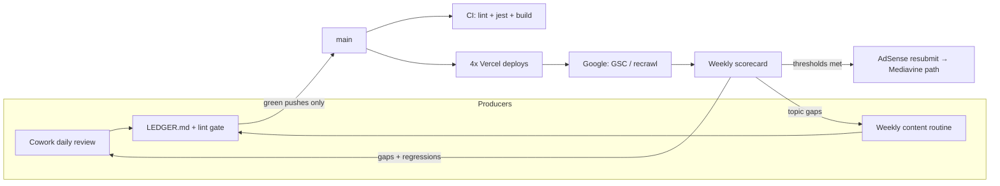

# feat: Elite-standing program for the 4-domain solitaire portfolio

## Summary

Make playfreecellonline.com, solitairestack.com, playklondikeonline.com, and playspidersolitaireonline.com legitimate, well-visited, tightly-run properties that pass any Google or ad-network reviewer's scrutiny: green quality pipeline, governed automation, verified indexation and trust signals, compounding content and off-site legitimacy, all tracked by a recurring per-property scorecard.

---

## Problem Frame

Revenue is ~$0.27/day on one AdSense-approved domain; solitairestack.com was rejected for "low value" (scaled/doorway footprint, new domain). The codebase is strong — 230+ pages, schema, daily challenges, a solver — but the operation around it has been leaking trust signals:

- **CI has been red on every push for weeks.** Six `react-hooks/refs` lint errors fail the Lint step in ~1 minute, so tests and build never run and every push (2–4/day from automated producers) fires a failure email. Red-by-default CI trains the owner to ignore real failures.
- **Two uncoordinated content producers** write into the repo: a Claude Cowork daily review (QA + fixes + content, e.g., surprise French locale pages) and a weekly cloud content routine. No shared ledger; overlap and scaled-content patterns are exactly what got solitairestack rejected.
- **Standalone-site work shipped 2026-07-02** (blog filter flip, per-site sitemaps, network schema) but is unverified in Google's eyes — GSC resubmission, recrawl monitoring, and E-E-A-T depth per spoke remain open.
- **No recurring measurement.** "Tight" and "highly regarded" are currently vibes; there is no scorecard that would show a reviewer-visible regression (canonical drift, sitemap bloat, CWV decay) before it costs rankings.

## Requirements

- **R1** — CI is green on every push; failure emails are rare and meaningful.
- **R2** — Every automated producer (Cowork daily, cloud weekly) validates lint/type before pushing and coordinates topics through a shared ledger.
- **R3** — Each domain is verifiably indexed as a standalone property: correct sitemaps in GSC, canonicals honored, old cross-domain URLs consolidated.
- **R4** — Each domain carries reviewer-grade trust signals (per-spoke identity, policy pages, author depth) with no scaled/doorway footprint.
- **R5** — Organic traffic grows via topical cluster depth, internal links, and off-site legitimacy (embeds, outreach, brand signals) — not just page count.
- **R6** — A recurring scorecard reports per-domain health (indexation, CWV, content counts, revenue) so regressions surface within a week.
- **R7** — Automation stays within budget (Vercel Pro credit was at $16/$20 this month; four production builds fire per push).

---

## Key Technical Decisions

- **Fix the lint errors, keep the gate blocking** (vs. relaxing lint). A gate that never fails is decoration; the errors were real React-19 correctness issues (refs read during render). *(Done: commit `69caf97`.)*
- **Keep the Cowork daily review running with a tightened mandate** (vs. pausing it). It ships useful fixes (H1s, hreflang); the failure mode was uncoordinated expansion (French locale) — solved by ledger + validation requirements, not by killing the producer.
- **One editorial ledger file in-repo** (`docs/content-pipeline/LEDGER.md`) as the coordination point between producers — both agents read/append it; no external tooling.
- **Locale expansion is gated, not banned.** New locales (the FR pages that appeared 2026-07-03) must ship complete: localized play UI, reciprocal hreflang across all locale siblings, H1s, and a full content cluster — otherwise they read as doorway pages to a reviewer.
- **Measurement built from existing scripts** (`scripts/pull-google-metrics.mjs`, `pull-public-metrics.mjs`, `adsense-recovery-audit.mjs`) plus live-crawl checks, emitted as a dated markdown scorecard — no new analytics infra.
- **AdSense resubmission for solitairestack stays held** until the scorecard shows the standalone-blog recrawl has landed (old cross-domain blog URLs consolidated, spoke posts indexed) — consistent with the 2026-05-31 rejection analysis.

## High-Level Technical Design

The loop: governed producers push green commits → deploys → Google recrawls → scorecard measures → findings feed the next production cycle. Monetization upgrades unlock at measured thresholds instead of hope.

---

## Implementation Units

### U1. Repair the CI lint gate

**Goal:** Green CI on every push; daily failure emails stop. *(Shipped this session — commit `69caf97`.)*
**Requirements:** R1
**Dependencies:** none
**Files:** `src/app/(main)/pyramid/PyramidGamePage.tsx`, `src/app/(main)/tripeaks/TriPeaksGamePage.tsx`, `eslint.config.mjs`, `.gitignore`
**Approach:** Mirror the game engine into render-safe state (refs must not be read during render); remove the committed `.claude/worktrees` gitlink that broke CI checkout cleanup; ignore `tmp/` scratch in eslint and git.
**Test scenarios:** Covered by existing jest suite + `npm run lint` exit 0; manual smoke of Pyramid/TriPeaks pages (board renders, new game works).
**Verification:** CI run on the fix commit completes green; no failure email for it.

### U2. Automation governance

**Goal:** Both producers validate before pushing, coordinate topics, and their mandates are documented in one place.
**Requirements:** R2, R7
**Dependencies:** U1
**Files:** `docs/content-pipeline/LEDGER.md` (create), `docs/AUTOMATION.md` (create)
**Approach:** LEDGER.md holds a dated append-only table: date, producer, type (content/fix/locale), slugs/paths touched, target site. AUTOMATION.md registers every producer (Cowork daily review, weekly cloud routine, FedTools noise excluded) with mandate, cadence, cost notes, and the shared rules: lint+tsc must pass before push; no new locales or route families without a plan reference; append to the ledger every run. The weekly cloud routine prompt already carries these rules *(done 2026-07-03)*; the Cowork daily review mandate is a user-owned paste (text provided in AUTOMATION.md).
**Test scenarios:** none — documentation/coordination artifacts; enforcement is the CI gate (U1) plus prompt mandates.
**Verification:** Next runs of both producers append ledger rows and push green.

### U3. Weekly property scorecard

**Goal:** One dated markdown report per week covering all four domains: sitemap URL counts, blog URL counts, canonical/hreflang spot-checks, robots/noindex spot-checks, deploy state, GA sessions (via existing scripts where authed), AdSense revenue note, Vercel credit note.
**Requirements:** R6, R7, R3
**Dependencies:** U1
**Files:** `scripts/property-scorecard.mjs` (create), `docs/analytics/scorecards/` (create dir), `package.json` (add `scorecard` script)
**Approach:** Node script, no new deps: fetch each domain's `/sitemap.xml` (counts + diff vs. previous run), curl 5-6 canary URLs per domain asserting canonical/hreflang/H1/200 status, check one known cross-domain 301, write `docs/analytics/scorecards/YYYY-MM-DD.md`. Reuse patterns from `scripts/adsense-production-check.mjs`. Wire into a weekly cloud routine (or the Cowork review) after it works locally.
**Patterns to follow:** `scripts/indexnow-submit-sitemap.mjs` (fetch/parse sitemaps), `scripts/adsense-recovery-audit.mjs` (report shape).
**Test scenarios:** run against live domains → report file created with 4 domain sections and non-zero URL counts; a domain fetch failure → section marked FAILED, script still exits 0 and writes remaining sections; second run → includes deltas vs. prior report.
**Verification:** Two consecutive weekly reports exist and a seeded regression (e.g., temporarily wrong canary expectation) is flagged.

### U4. Indexation follow-through (GSC)

**Goal:** Google actually registers the standalone-site restructure.
**Requirements:** R3
**Dependencies:** U1
**Files:** none (operational) — findings logged in scorecards (U3)
**Approach:** User resubmits sitemaps in GSC for all 4 properties (manual, ~2 min — Google ignores IndexNow). Scorecard then tracks: spoke blog posts entering the index, old cross-domain blog URLs flipping to "Page with redirect"/consolidated, hreflang clusters (EN/ES/FR) reported without errors. URL Inspection spot-checks on the 2 newest spoke posts after 1 week.
**Test scenarios:** none — operational; measured via U3.
**Verification:** Within ~3 weeks, GSC shows spoke-canonical blog URLs indexed under their own domains and no sitemap errors.

### U5. Content operations and locale gate

**Goal:** Content velocity continues without recreating the scaled-content footprint.
**Requirements:** R4, R5, R2
**Dependencies:** U2
**Files:** `docs/CONTENT_STRATEGY.md` (amend: locale policy + ledger rule), `src/content/blog/*` (ongoing)
**Approach:** Codify: (a) cadence stays ~2 spoke posts/week + Cowork fixes; (b) locale policy — a locale ships only with localized play UI + reciprocal hreflang across ALL locale siblings + at least the core cluster (play, rules, strategy) or it doesn't ship; audit the new FR pages against this bar and complete or roll back; (c) hub's noindexed variant subpages get quarterly review — consolidate or improve rather than accumulate.
**Test scenarios:** FR audit checklist executed once: `/freecell-en-francais` + `/jouer` have H1, reciprocal hreflang including ES↔FR, localized UI; failures become fix commits.
**Verification:** CONTENT_STRATEGY.md carries the policy; FR pages pass the checklist; ledger shows both producers citing it.

### U6. Experience quality (CWV + play UX)

**Goal:** The properties feel first-rate to users and to CrUX data.
**Requirements:** R5
**Dependencies:** U3 (baseline first)
**Files:** `src/components/dom-freecell/DomGameShell.tsx` (landscape toolbar), `src/components/dom-klondike/*`, `src/components/dom-spider/*` (hint highlighting), plus per-finding files
**Approach:** Baseline CWV per domain via PageSpeed Insights (scorecard section). Then the known UX backlog in priority order: landscape mobile hides timer/moves below 500px height; Klondike/Spider hints auto-execute instead of teaching (highlight like FreeCell); generalize daily challenges beyond FreeCell (retention loop for the two spokes). Each lands as its own commit with tests where behavior changes.
**Test scenarios:** per item when picked up — e.g., hint highlighting: hint press highlights source+target without mutating state; second press executes; deadlock returns no-highlight.
**Verification:** CWV baseline recorded; at least the first two backlog items shipped and verified in-browser.

### U7. Off-site legitimacy

**Goal:** Signals Google can't get from the site itself: links, embeds, brand queries.
**Requirements:** R5, R4
**Dependencies:** U4 (be indexable before promoting)
**Files:** none initially (operational; uses existing `/embed` + `/embed-generator`, `docs/outreach-templates-2026-03.md`)
**Approach:** Three plays, smallest first: (1) embed widget outreach — the embeddable FreeCell already exists; pitch it to teachers/bloggers/senior-community sites from the existing outreach target list (backlink per embed); (2) resource-page outreach for the research pages (win-rates data, solvability research are genuinely citable); (3) share-loop — the daily-challenge share cards already exist; surface share CTAs more prominently post-win. Track placements in the scorecard.
**Test scenarios:** none — operational.
**Verification:** First 5 external placements/links logged; referral + brand-query impressions appear in GSC.

### U8. Monetization ladder

**Goal:** Revenue grows from $0.27/day by unlocking inventory and upgrading the stack at measured thresholds.
**Requirements:** R6 + business goal
**Dependencies:** U3, U4
**Files:** none initially (operational)
**Approach:** Stage 1: resubmit solitairestack to AdSense only when the scorecard shows the U4 recrawl landed (spoke posts indexed, no scaled-footprint leftovers) — likely 3-4 weeks. Stage 2: same evaluation for the two spokes (currently serving AdSense under the network account — verify they're individually approved/serving). Stage 3: at ~30-50K sessions/month network-wide, apply to Mediavine Journey / Freestar per the competitive strategy (2-4x AdSense RPM on this 65+ Tier-1 audience).
**Test scenarios:** none — operational.
**Verification:** Each stage's entry criteria recorded in the scorecard before the trigger is pulled.

---

## Scope Boundaries

- **Out of scope:** the FedTools repo (its failing Vercel deploys and 8 routines are separate); paid acquisition; new game engines/variants beyond the UX backlog.
- **Deferred to follow-up work:** Klondike/Spider sidebars (leaderboard/achievements parity); author-page `next/Image` migration; per-game settings separation; solver generalization beyond FreeCell.

## Risks & Dependencies

- **GSC/GA auth**: metrics scripts may need re-auth; scorecard degrades gracefully to live-crawl checks (flagged, not fatal). User owns GSC sitemap resubmission.
- **Cowork mandate is user-owned**: I can't edit that schedule; if the paste-line isn't added, the CI gate still protects `main` but red-push noise could resume from that producer. Mitigation: gate is the backstop; ledger reveals non-compliance.
- **Vercel credit**: four builds per push; if credit exhaustion nears, batch producer pushes (weekly routine already batches; Cowork review should combine commits into one push per run — in its mandate).
- **Google timing**: recrawl/consolidation is weeks, not days; resist resubmitting AdSense early (the known failure mode).

## Open Questions

- Does the user want the scorecard as a cloud routine (costs credit) or run from the Cowork daily review (already running daily)? Default: fold into Cowork weekly step; standalone routine only if Cowork lacks network access to run it.
- PageSpeed Insights API key for CWV in the scorecard — free but needs the user to create one; until then, CWV checks are manual/Lighthouse-local.

## Sources & Research

- Email investigation 2026-07-03: GitHub CI failure notifications (every main push), fedtools Vercel failures, Vercel credit alert ($16/$20).
- CI log analysis: 6 `react-hooks/refs` errors, Pyramid/TriPeaks pages; committed worktree gitlink breaking checkout cleanup.
- Prior deep-dive sessions (2026-07-01/02): site-shell, gameplay, SEO/trust audits; blog Wave-11 filter flip; sitemap/canonical repair; per-property live verification.
- `docs/competitive-strategy.md`, AdSense rejection analysis (2026-05-31), memory: `project_portfolio_unification_2026-07.md`.
